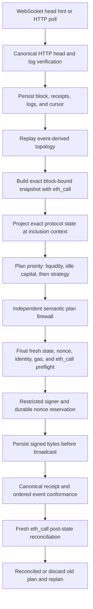

# Vault V2 Reallocator: Architecture and Senior Engineering Review

## Document status

- Review target: `agent/production-runtime` (exact commit recorded in the release manifest)
- Review branch: `agent/production-runtime`
- Live chain: HyperEVM, chain ID `999`
- Live Vault V2: `0x51254785367d73A10a2Ea7d44B8e97b749BfbE8b`
- Checked-in operating mode: Shadow
- Storage: durable JSON checkpoint plus checksummed segmented journal
- Primary strategy in the checked-in HyperEVM configuration: Top-K APY diversification
- Last updated: 2026-08-08

This document describes what the current code actually does, the reasoning behind
the major boundaries, problems encountered during development and deployment,
how those problems were resolved, and the remaining issues that need senior
engineering review. It is not a replacement for the configuration schema,
protocol lock, source code, or runbook.

## 1. Executive summary

The application is a Rust service that manages one chain and one allocator nonce
lane per process. A process may manage multiple Vault V2 vaults on that chain if
they use the configured allocator. Multiple chains require separate processes,
ports, and data directories.

The bot does not trust events as balances. Events tell the bot that something may
have changed and maintain a replayable topology. Exact contract calls establish
the state used for planning. Every snapshot, projection, plan, simulation,
signature, receipt, and reconciliation record is tied to an identified EVM block
context.

The automatic path is:



The system has three planning priorities:

1. Restore required withdrawal liquidity and service constraints.
2. Deploy verified excess idle capital while retaining the configured reserve.
3. Apply the vault-selected allocation policy: rate/utilization equalization or
   Top-K APY diversification.

This order is intentional. A rate improvement must never take priority over the
vault's ability to serve users or correctly account for idle assets.

## 2. Goals, non-goals, and trust assumptions

### 2.1 Goals

- Keep configured markets closer in spot borrow APR/utilization, or maintain a
  diversified conservative native-supply-yield allocation.
- React to deposits, withdrawals, borrows, repays, and configuration events,
  plus a mandatory five-minute canonical-time tick that refreshes every strategy.
- Execute normal reallocations autonomously without per-transaction approval.
- Keep assets inside the configured Vault V2 and approved adapters.
- Ensure only typed, validated allocation and deallocation calls reach signing.
- Recover deterministically after restarts, reorgs, RPC failures, reverts, and
  receipt/state drift.
- Operate with latest-only RPC providers without pretending historical state is
  available.
- Provide read-only health, runtime state, plans, transactions, metrics, and
  alerts.

### 2.2 Non-goals

- Vault V1 allocation execution as the parent vault. Vault V1 may be used only
  behind the configured Vault V2 liquidity adapter.
- Oracle incident detection.
- Liquidations.
- Governance, fee, role, cap, queue, or market-management transactions.
- Cross-vault funding.
- Arbitrary calldata signing or a generic RPC write proxy.
- Floating-point protocol or planning arithmetic.
- Guaranteeing a target spread when the vault does not own enough movable
  capital or configured caps/liquidity make it infeasible.

### 2.3 Current trust assumptions

- The configured official contract source identities and runtime code hashes are
  correct.
- The allocator EOA is exclusive to this process. The user explicitly confirmed
  that no other wallet, script, bot, or host uses its nonce lane.
- At least one configured provider can return current canonical state correctly.
- When an independent checkpoint provider is configured, disagreement stops
  execution rather than selecting one provider optimistically.
- The host, secret file, Rust toolchain, and operating user are trusted.
- The process can write and fsync its data directory before broadcasting.

## 3. Repository structure

The root contains only build, configuration, protocol identity, monitoring,
operator, source, and test material:

| Path | Responsibility |
| --- | --- |
| `src/chain/` | Canonical heads, logs, receipts, reorgs, providers, and multicalls |
| `src/state/` | Exact snapshots, topology, caps, attribution, projections, and capability checks |
| `src/morpho/` | Exact Morpho, Adaptive Curve, share, fee, and adapter arithmetic |
| `src/planner/` | Pure liquidity, capital, rate/utilization planning and sequential simulation |
| `src/transaction/` | Typed encoding, decoding, firewall, preflight, signer, nonce, and pending lifecycle |
| `src/reconciliation/` | Receipt-event conformance and fresh post-state checks |
| `src/storage/` | Single-writer JSON checkpoint/journal and recovery |
| `src/runtime/` | Service ownership, state machines, planning/execution orchestration, and supervision |
| `src/api/` | Read-only HTTP views |
| `src/telemetry/` | Health, Prometheus, Telegram, PagerDuty, and alert suppression |
| `abi/` | Minimal committed contract interfaces; no runtime ABI download |
| `config.example.yaml` | Commented human configuration template |
| `config.example.json` | Strict machine-readable equivalent |
| `protocol-lock*.toml` | Pinned sources, deployed identities, and runtime hashes |
| `monitoring/` | Prometheus and Grafana provisioning |
| `operator/` | Restricted deposit, withdrawal, collateral, borrow, and repay tools |
| `tests/` | Integration, reorg, storage, firewall, math, configuration, and monitoring tests |

An obsolete chain-specific `src/chain/hyper_evm.rs` module was removed. Chain
behavior is selected by explicit configuration policy rather than an implicit
chain-ID code branch.

## 4. Process and ownership model

`src/main.rs` constructs the process. A retained Tokio `JoinSet` owns every
long-running worker:

1. **Chain service**: selects canonical heads and persists verified chain data.
2. **State service**: owns topology replay, exact snapshots, planning artifacts,
   per-vault readiness, and runtime state.
3. **Execution service**: owns the signer, nonce lane, preflight, transaction
   lifecycle, conformance, and reconciliation.
4. **Planning coordinator**: consumes a replaceable per-vault revision and
   publishes at most one plan for the newest complete state.
5. **Read-only API**: serves health, metrics, snapshots, rates, plans, episodes,
   transaction summaries, and alerts.
6. **Systemd watchdog**: proves supervisor, chain, state, and storage progress.

The JSON storage actor is a separate single-writer owner. Other services send
bounded commands and wait for acknowledgements. They cannot mutate the durable
document concurrently.

Canonical chain updates use a bounded channel and remain durable and ordered.
Replaceable head hints and per-vault planning revisions use `watch`, so an event
burst cannot grow planning memory without bound. Transactions are recovered from
durable unresolved state rather than an in-memory notification. The 128-command
storage mailbox has timeouts plus depth, high-water, and oldest-age metrics.

Worker errors and Tokio task panics are detected, classified, and restarted from
durable state. Vault or signer uncertainty changes execution readiness while the
API, metrics, recovery, and other vaults remain alive. Only unrecoverable
process-integrity or critical-state corruption terminates the process.

## 5. Configuration and protocol identity

### 5.1 Normal and advanced configuration

The strict YAML/JSON schema is split into:

- `normal`: instance, mode, chain, providers, signer, alerts, vaults, adapters,
  market parameters, and addresses normally supplied by the operator.
- `advanced`: snapshot, reorg, transaction, gas, solver, confirmation, episode,
  and strategy policy normally reviewed by the allocator or engineer.

Unknown keys are rejected. YAML and JSON deserialize into the same Rust types and
produce a canonical configuration revision. RPC URLs and private keys are never
stored in committed configuration; configuration names environment variables.

### 5.2 Chain neutrality

There is no behavior switch of the form `if chain_id == 999`. A custom block
profile is enabled only by selecting a reviewed `block_opportunity_policy`.
Ordinary chains use `every_canonical_block`. The HyperEVM profile adds the
reviewed signer-lane check and fast-block opportunity semantics.

The same binary can run on another compatible chain by changing configuration,
protocol lock, data directory, and bind port. A separate process is required for
each chain because canonical cursor and nonce ownership are process-wide trust
boundaries.

### 5.3 Protocol lock and runtime code hashes

`protocol-lock.toml` pins source repository, source commit, contract address,
runtime code hash, chain ID, and signer service identity. Startup compares the
configuration and lock, then checks deployed code. Original or upgraded adapter
behavior is selected by reviewed runtime identity rather than an operator label.

The release gate additionally checks mode, configured evidence, signer kind,
chain, configuration revision, protocol-lock digest, and required environment.
Missing or inconsistent inputs prevent Execute startup.

## 6. Canonical chain ingestion

### 6.1 WebSocket is a hint; HTTP is authoritative

WebSocket block subscriptions reduce latency but never establish canonical
state. Every WebSocket hint triggers the same HTTP polling path. A five-second
fallback poll remains active when WebSocket works; a one-second polling loop is
used when it does not.

For each poll, the chain service:

1. Reads the latest HTTP header.
2. Compares the independent checkpoint when configured.
3. Loads the durable cursor.
4. Proves direct extension or searches for a common ancestor.
5. Fetches only watched logs, then validates their complete receipts and block
   attribution.
6. Persists the block bundle and cursor before publishing it to state.
7. Publishes the canonical head only after persistence acknowledgement.

The filter rejects unwatched addresses, removed logs, logs outside the requested
range, missing block fields, and deployment-unknown event shapes.

### 6.2 Latest-only mode

The HyperEVM provider does not reliably offer arbitrary historical `eth_call`.
The implemented mode therefore separates topology history from execution state:

- Historical log ranges reconstruct event-derived topology and invalidations.
- A bounded recent header window is retained for reorg detection.
- Relevant old event blocks are retained even when intermediate irrelevant
  headers are compacted.
- Exact current calls are made against a reported latest block context.
- That candidate is accepted only after its block has entered canonical replay,
  the topology revision matches, and no later relevant event invalidates it.

This implements the requested behavior: an event can arrive from any recent
block; before deciding, the bot reads the current vault and market state. It does
not attempt to execute an event-derived balance.

### 6.3 Reorg handling

When the stored cursor is no longer canonical, the service searches backward
within `reorg_rescan_blocks`. It stops if no common ancestor can be proven. On a
bounded reorg it:

- rewinds canonical blocks, logs, receipts, snapshots, and affected runtime
  records;
- publishes a reorg update;
- rebuilds topology through the common ancestor;
- replays the replacement branch; and
- requires fresh exact state before planning.

## 7. Exact state and topology

### 7.1 Events invalidate; calls establish state

Events maintain discovery and tell the state owner what must be refreshed. They
are never authoritative balances. Exact snapshots use contract calls for:

- parent vault asset, idle assets, stored assets, supply, fees, gates, roles,
  adapters, liquidity adapter, penalties, and dead shares;
- adapter parent, asset, Morpho address, IRM, adapter ID, active and historical
  market IDs, real assets, skim recipient, and pending operations;
- every configured market's parameters, supply/borrow assets and shares, update
  timestamp, fee, rate-at-target, and loan-token liquidity;
- internal adapter shares versus actual Morpho shares;
- absolute and relative caps and recorded allocation;
- Vault V1 liquidity-adapter assets, shares, idle market, and withdrawal limits;
- current code hashes and proxy-linked identities; and
- idle locks and unattributed parent idle assets.

Every snapshot contains chain ID, complete block reference, exact EVM timestamp,
static config revision, dynamic topology revision, and its own canonical hash.

### 7.2 Time handling

Block counts are never treated as seconds. Interest and Adaptive Curve
projections use the timestamp from the exact canonical block. Inclusion
opportunity counts are used only for lifecycle policy such as replacement and
cancellation. This fixes the earlier bug where “two blocks” could accidentally
be modeled as “two seconds.”

### 7.3 Capability index

The state service derives explicit capabilities, including observation,
projection, allocation, supported deallocation, user deposit/withdraw modeling,
lock verification, seed requirements, reward policy, and episode-state
verification. Execute planning is disabled if any required capability is absent.

### 7.4 Expected protocol drift

Legitimate Morpho behavior refreshes state instead of being labeled corruption:

- a relative allocation above its relative cap blocks new allocation and is
  deallocated only when configured policy requires it;
- external permissionless `forceDeallocate` increases idle assets and triggers
  refresh/replan, while the routine strategy never calls it;
- Vault V2's four ERC-4626 maximum views returning zero does not disable the
  vault;
- a temporary Vault V1 adapter `realAssets` revert makes that vault unavailable
  and retryable without killing the process;
- inclusion-time shares use the matching official Morpho/adapter events and the
  exact post-state rather than a stale prediction; and
- interest-driven allocation changes are ordinary state drift.

An unknown adapter, changed asset, code identity, or role still quarantines the
affected execution scope.

## 8. Projection and exact arithmetic

Protocol and planning arithmetic use checked integer types (`U256`, `I256`, and
semantic wrappers). There is no `f32` or `f64` in protocol, planning, or execution
arithmetic.

The arithmetic modules reproduce:

- Morpho share conversions and rounding direction;
- accrued interest and fee shares;
- Adaptive Curve utilization, error, rate-at-target movement, and spot borrow
  rate;
- supply rate;
- Vault V2 asset/share accounting;
- direct adapter allocation and deallocation behavior; and
- Vault V1 liquidity-adapter conversions.

A projection is not a loose forecast. It is an exact integer simulation for a
named block/inclusion scenario. Overflow, timestamp regression, share-price
violations, insufficient shares, or insufficient liquidity reject the candidate.

## 9. Planning architecture

The planner is pure. It imports no RPC provider, storage actor, signer,
environment, wall clock, HTTP server, or telemetry transport. `PlanningInput`
contains an immutable exact snapshot, inclusion scenarios, projections,
validated vault configuration, optional active strategy episode, pending idle
deployment, and resource reservations.

### 9.1 Planning priority

`refresh_priority_plan` evaluates:

1. **Liquidity maintenance**: restore the liquidity adapter/reserve and required
   withdrawal coverage.
2. **Capital deployment**: deploy verified excess idle assets through the
   vault-selected policy. Top-K uses its shared diversified target here, so a
   fresh deposit cannot be captured by a one-market legacy planner.
3. **Ongoing strategy**: either reduce the selected rate/utilization spread or
   move existing supply toward the confirmed Top-K target.

At most one plan is published for a snapshot.

### 9.2 Strategy choices

The operator selects one vault strategy:

- `spread_equalization`, with `spot_borrow_rate_spread` or
  `utilization_spread` as its exact integer objective.
- `top_k_apy_diversified`, which ranks the minimum of current, exact post-probe,
  and downside-fast/upside-slow smoothed native supply yield.

The live utilization policy enters above the configured 25 bps gap and targets
10 bps or less. The acceptable operator range discussed was 10–25 bps. The rate
policy supports its separately configured entry and target thresholds.

Spread equalization uses an episode that freezes direction long enough to avoid
single-block noise. Top-K instead persists selected markets, smoothed rates, a
pending membership set, its canonical confirmation timestamp, and generation.
Its confirmed weights are 40/40/20 for three markets or 35/35/15/15 for four.
For a yield-driven target transition, the checked-in policy requires at least
200 APY bps of conservative ranking improvement, at least 250 APY bps of exact
current-position underperformance before exit, and at least 100 APY bps of
post-probe improvement. These are exact compounded-APY comparisons, not simple
APR aliases. The separate fourth-market diversification gaps are 50 bps to enter
and 100 bps to remain selected. Yield-driven membership changes require 1,800
canonical seconds; an invalid market is removed immediately.

Relevant events trigger exact refreshes. Independently, every 300 canonical
seconds `DirtyReason::StrategyTick` marks all deployed vaults dirty and runs the
same priority planner even when no event occurred. Raw events remain durable;
only replaceable planning triggers are coalesced.

### 9.3 Ninety-percent tranche

The solver first calculates the best feasible movement on its candidate lattice.
The execution tranche is then limited to 90% of that calculated movement, not
90% of raw capacity. The bot waits on a conservative five-second execution
cadence, refreshes exact state, and repeats only when another movement is still
needed and feasible.

This reduces sensitivity to interest, other users, and integer-boundary drift
without requiring a human approval. It also means convergence may take multiple
transactions.

### 9.4 Constraints

Candidate construction and sequential simulation enforce:

- configured market mode and rate group;
- parent and adapter identities;
- absolute and relative caps;
- source shares and source market token liquidity;
- shared Morpho loan-token liquidity consumed once across the plan;
- maximum source utilization;
- destination seed requirements;
- minimum and maximum position assets;
- active-market complete-exit policy;
- exact reserve and withdrawal coverage;
- hourly and daily movement budgets;
- maximum immediate loss and terminal value sacrifice;
- no use of free vault token donations as routine transaction funding; and
- deterministic action ordering and final conservation.

The solver certificate records candidate lattice hash, nodes evaluated, search
limit, whether the lattice search completed, target reachability, and whether the
target was reached. “Target unreachable” is a valid result when available vault
capital cannot materially change system-wide utilization.

### 9.5 Latest-event-wins coordination

Every canonical event is persisted and replayed; only the downstream planning
notification is coalesced. `DirtyAccumulator` keeps one complete current entry
per vault with latest relevant event block, read-set revision, topology revision,
config revision, reason set, and planner generation. A `watch` channel replaces
older generations without dropping affected vaults or markets.

After an event burst, the state owner performs one complete aggregate/latest
snapshot. Planning may publish only when the snapshot block covers every
processed relevant event and all revision/fingerprint keys still match. An event
arriving during snapshot or pure planning supersedes the result normally; it is
discarded and does not become an incident. A topology or identity event rebuilds
the read set even when its event block is already covered by the snapshot.

Immediately before signing, execution rechecks revisions, obtains a fresh atomic
safety fingerprint, and simulates the exact typed call from the allocator. After
signed bytes are durable, later events cannot create a second nonce; they remain
dirty until receipt recovery and exact post-state reconciliation finish.

## 10. Action grammar and transaction firewall

Routine writes target only the configured Vault V2. A plan contains typed
allocate/deallocate actions against configured adapters and exact market data.
The independent firewall does not trust planner output. It rechecks:

- chain, vault, asset, signer, config revision, topology revision, and snapshot;
- target, selector, value, and permitted multicall structure;
- adapter and market membership;
- exact ABI decoding and canonical re-encoding;
- requested amounts, order, cap impact, movement budgets, and loss bounds;
- sequential token flows and final conservation; and
- plan ID/hash and transaction field bounds.

There is no CLI, API, database field, plugin, or signer method that accepts
arbitrary calldata.

## 11. Final preflight and signer boundary

The execution service monitors its durable signer lane and owns at most one
unresolved transaction. Planning is event-triggered, not periodic. Immediately
before signing it:

1. Rebuilds/refreshes the exact execution context.
2. Verifies the current canonical cursor and relevant-event history.
3. Rechecks deployed identities and optional HyperEVM signer lane.
4. Reads the confirmed nonce using `eth_getTransactionCount(..., "latest")`;
   the RPC `pending` tag is never a safety dependency.
5. Verifies no unresolved transaction already owns the lane.
6. Simulates inclusion scenarios with exact timestamps.
7. Runs `eth_call` from the real configured allocator EOA.
8. Estimates gas and applies the configured signed gas bound.
9. Revalidates the exact typed calldata through the firewall.
10. Reserves plan, nonce, calldata, fees, gas, and movement durably.

The signer interface accepts only:

- a validated routine Vault V2 allocation transaction;
- an identical-calldata same-nonce fee replacement; or
- a same-nonce cancellation for the known unresolved transaction.

The current live deployment uses the restricted local-key implementation because
the user accepted this operating model. The remote signer implementation pins
HTTPS host identity, client certificate, authentication secret, chain, signer,
vault set, gas limit, and fee bounds.

## 12. Transaction durability, replacement, and recovery

The durable lifecycle is:

```text
nonce_reserved
  -> signed
  -> submitted / replaced / cancellation_submitted
  -> included
  -> confirmed
  -> conformance_validated
  -> reconciled
```

Additional terminal or recovery states include `aborted_before_signing`,
`reverted`, `orphaned`, `cancelled`, `failed`, and `foreign_nonce_consumed`.

Important ordering rules:

- Nonce and calldata reservation is durable before signing.
- Raw signed bytes are durable before broadcast.
- A broadcast response is not success.
- Replacements retain identical calldata and nonce; only fees change.
- Cancellation uses the same known nonce and only for the known unresolved
  transaction.
- Startup loads unresolved state before permitting new signing.
- With no unresolved row, the next nonce is the confirmed/latest nonce.
- If the unresolved nonce equals confirmed nonce, all recovery providers are
  queried and identical persisted raw bytes are rebroadcast when absent.
- If confirmed nonce advanced, only a known matching inclusion continues;
  unknown consumption quarantines the signer while the process stays alive.
- A durable nonce ahead of confirmed nonce is local corruption and quarantines
  signing. No second nonce can be reserved in any unresolved case.
- An included transaction remains unresolved until canonical receipt,
  confirmation, conformance, and reconciliation complete.

Ordinary reverts and unexpected balances do not permanently pause the bot. The
old semantic plan is discarded, exact state is refreshed, and planning resumes
when nonce ownership, code identity, and accounting remain known. Identity
mismatch, ambiguous nonce consumption, or uncertain lock accounting remains
fail-closed.

## 13. Receipt conformance and current-state reconciliation

Receipt conformance validates the canonical status and ordered event/transfer
effects against the preflight record. It checks exact vault, adapter, market,
asset amount, cap IDs, allocation changes, transfer path, and action count.

Inclusion-time share counts are allowed to differ from an older prediction only
when the Morpho event and adapter event report the same actual shares. This
handles legitimate interest/rounding changes without weakening asset, market,
calldata, or final-allocation checks.

After conformance, reconciliation performs fresh exact calls. It records:

- snapshot and block;
- current configured-objective spread;
- whether reserve and service constraints pass;
- whether another plan is needed;
- whether pending capital deployment resolved; and
- a canonical reconciliation report hash.

The transaction becomes `reconciled` only after this record is durable.

## 14. JSON persistence design

The storage actor owns format version 3. State includes:

- canonical blocks, logs, receipts, and chain cursors;
- exact snapshots and topology history;
- plans, preflights, rate episodes, and movement reservations;
- nonce reservations, raw signed transactions, attempts, and lifecycle state;
- conformance and reconciliation records.

Each mutation clones and validates the next state, increments a monotonic
revision, computes a JSON Patch, links it to the previous journal hash, writes a
checksummed journal record, flushes it, and acknowledges only after durability.
Every 128 mutations it writes a new atomic checkpoint and prunes checkpointed
segments. Hot state is bounded: 512 blocks, 32 snapshots, 32 plans, and 256
topology revisions, while records needed by unresolved transactions and retained
topology remain pinned.

The state file uses an exclusive process lock. A second writer fails startup.
Backups go through the actor, and startup replays/checks the journal before any
execution capability becomes ready.

## 15. Runtime state machine and readiness

Each vault moves through explicit states including `starting`, `catching_up`,
`observe`, `shadow`, `automatic`, `pending_transaction`, `pending_deployment`,
`idle_locks_active`, recovery, and typed pause states. Invalid transitions are
rejected.

Execute readiness requires valid configuration and protocol identity, providers
ready, chain caught up, storage ready, exact state ready, signer ready, no
operator pause, and consistent pending-transaction state.

The process may be live while readiness is temporarily false during startup,
head catch-up, snapshot retry, or provider inconsistency. Signing requires
`ready_for_execute`, not mere liveness.

## 16. API, metrics, alerts, and logs

The HTTP server is GET-only. Important endpoints are:

- `/health/live`
- `/health/ready`
- `/metrics`
- `/v1/vaults`
- `/v1/vaults/{address}`
- `/v1/vaults/{address}/snapshot`
- `/v1/vaults/{address}/rates`
- `/v1/vaults/{address}/plan`
- `/v1/vaults/{address}/episode`
- `/v1/transactions`
- `/v1/alerts`

Prometheus exports process/readiness, provider state, block freshness, nonce lane,
snapshot retries, transaction state, per-vault spread, and per-market rate and
utilization. Grafana/Prometheus provisioning is in `monitoring/`.

Telegram and PagerDuty use typed alert severity and repeat suppression. External
delivery is intended for persistent/actionable conditions rather than normal
replanning or one-off RPC noise.

Production terminal logs are compact and omit Rust module targets. A successful
exact refresh prints one line:

```text
INFO block processed block=42519364
```

It does not print one line for every polling attempt. Coalesced heads or transient
snapshot retries can produce block-number gaps. The log means exact state was
successfully refreshed at that canonical block, not merely that a head was seen.

## 17. Operator test tools and force-deallocation withdrawal

The `operator/` tools use a separate depositor/borrower wallet and refuse the
configured allocator key. They verify chain, code, asset, decimals, balances,
and simulate exact calls before confirmation.

Vault V2 deliberately returns zero from the ERC-4626 `maxDeposit` and related
max views. The Python tool therefore uses preview functions, owned shares, and
exact simulation instead of interpreting zero as “deposits disabled.”

For withdrawal:

1. Simulate ordinary `withdraw`.
2. Only if the exact revert is `NotEnoughLiquidity()` inspect configured direct
   market adapter positions.
3. Verify adapter code hash and derive each market ID from its configured market
   parameters.
4. Read live expected assets and live force-deallocation penalty.
5. Build a single atomic Vault V2 multicall containing the required
   `forceDeallocate` calls followed by `withdraw`.
6. Simulate the complete multicall from the depositor.
7. Print the exact asset penalty estimate and require `YES` before signing.

If any subcall fails, the entire multicall reverts. The live 25 USDC withdrawal
used a zero-penalty force deallocation successfully.

## 18. Production deployment model

Routine production deployment uses the prebuilt binary directly under systemd.
CI emits a release manifest containing source commit, Cargo.lock hash, config
revision, protocol-lock digest, binary SHA-256, build identity, version, and
timestamp. `deploy/install-release.sh` verifies the artifact, validates config
and protocol lock, installs a versioned directory, and atomically switches
`/opt/morpho/current`. `deploy/morpho-v2-reallocator.service` provides restart,
watchdog, filesystem, privilege, and writable-path boundaries.

The previous Cargo/tmux process has now been replaced by a CI-built, checksummed
binary running directly under systemd. The live Shadow canary uses a versioned
release directory, an atomic `/opt/morpho/current` symlink, a protected
environment file, and durable state owned by the dedicated `morpho` user. A
tagged `main` release and a complete rollback exercise remain release-governance
requirements. No routine production deployment compiles on the host.

## 19. Live execution evidence

The deposit/withdraw/rebalance exercise produced:

| Action | Block | Transaction |
| --- | ---: | --- |
| Force-deallocation withdrawal of 25 USDC | 42,517,533 | `0x64c2a1f06aa2232887c51443236e505df78956a26ce0110f5945f49ddb6391a2` |
| Deposit of 25 USDC | 42,517,554 | `0x7215d20b7b33964cdd0c18e32adf46c61b8c1db486201d1dd34cb0a350435cd6` |
| Automatic capital reallocation of 25 USDC | 42,517,563 | `0x3301e26b6ac1c51b86a69a46903920cf286eeeceb898c34214c1f41dc26ad20e` |

The bot moved 25 USDC from the Vault V1 liquidity adapter into direct market
`0xbdceb93661a9efbd67f97ff2842d159a493f792e71f762c8ba426b586dc1c565`,
retained the configured 1 USDC liquidity reserve, consumed 365,296 gas, observed
zero positive asset loss, received a 19-log canonical receipt whose required
protocol effects passed ordered conformance, and reached durable `reconciled`
state.

Because 25 USDC is tiny compared with existing market liquidity, utilization
spread improved only from about 2,348.78 bps to 2,347.70 bps. This proves the
end-to-end mechanism, not meaningful market-level equalization.

The Top-K Shadow canary subsequently proved the event-driven path without
submitting an allocator transaction:

| Action | Block | Transaction | Result |
| --- | ---: | --- | --- |
| Approve 1 USDC | 42,576,630 | `0xf5afb70ffebd255062474d63df0b68cfb04e3482762c679c42a5426f53c75df9` | success on primary and independent RPC |
| Deposit 1 USDC | 42,576,634 | `0x81b5bbdafe5002fb3963e9ba3d11f84547648775f07fbc2311014d2e3e35d2ae` | detected and replanned at block 42,576,635 |
| Withdraw 1 USDC | 42,576,830 | `0x78630e4ad400c33a481b4828828a7480891ca5b1189292d7223083c80563bc0b` | detected and replanned at block 42,576,831 |

The wallet and vault returned exactly to their starting state: 1 USDC in the
wallet, 39 vault shares representing 39 USDC, and 40 USDC total vault assets.
The five-minute canonical strategy tick also advanced independently of events.
After a controlled systemd restart, the durable cursor advanced from block
42,577,317 to 42,577,328, the unresolved transaction count remained zero, and
the same Top-K plan was reconstructed from fresh state.

## 20. Problems encountered and how they were resolved

### 20.1 RPC endpoints initially pointed to the wrong chain

**Symptom:** configured paid endpoints returned Base Sepolia chain ID `84532`
instead of HyperEVM `999`.

**Root cause:** infrastructure environment values were reused from earlier
testing.

**Resolution:** every provider is now named by configuration/environment and
startup compares `eth_chainId` to the configured chain before reading, signing,
or submitting. No chain is selected implicitly by a private key or vault address.

### 20.2 Historical state calls were unavailable

**Symptom:** pinned historical `eth_call` requests failed or could not satisfy the
old all-at-one-block pipeline.

**Root cause:** the available HyperEVM RPCs are suitable for current state but do
not provide reliable arbitrary historical state.

**Resolution:** latest-only ingestion reconstructs topology from logs, captures
an atomic current snapshot, waits until its reported block is canonically
replayed, rejects newer relevant events, and plans from current state. Historical
balances are no longer required or treated as authoritative.

### 20.3 Exact same-head preflight was impossible on one-second blocks

**Symptom:** snapshot and planning succeeded, but signing was repeatedly deferred
because event cursor, snapshot, simulation, and final gate could not all stay on
one exact fast block.

**Root cause:** a historical-RPC safety rule was applied unchanged to a
latest-only fast chain.

**Resolution:** retain strict pinned-block behavior where historical state is
available, and use a bounded latest-only path where a canonically replayed
snapshot remains valid unless a later relevant event, identity change, nonce
change, or exact simulation failure invalidates it.

### 20.4 Blocks were accidentally treated as seconds

**Symptom:** inclusion projections could model two future blocks as two seconds,
which is wrong on variable-block-time chains.

**Resolution:** protocol projections now use exact block timestamps. Lifecycle
opportunities and protocol elapsed seconds are distinct semantic values and have
separate tests.

### 20.5 Legitimate inclusion share counts caused reconciliation failure

**Symptom:** an execution could move the exact intended assets but accrue a
different number of shares than an older prediction.

**Root cause:** share counts change with interest and rounding between planning
and inclusion.

**Resolution:** receipt conformance allows the actual inclusion shares when the
Morpho and adapter events agree exactly, while retaining exact checks for vault,
market, assets, calldata, transfers, cap changes, receipt success, and fresh
post-state.

### 20.6 Ordinary reverts were treated too much like incidents

**Symptom:** a revert or changed balance could leave the system paused instead of
continuing from current state.

**Resolution:** deterministic reverts and post-state drift discard the old plan,
refresh exact state, and replan. Only unknown identity, ambiguous nonce,
unsupported capability, or uncertain accounting remains a hard stop.

### 20.7 Nonce contention design was overcomplicated for the operating model

**Symptom:** design work considered multiple independent users of the allocator
EOA.

**Decision:** the allocator is exclusive to this process, confirmed by the user.
One service owns one lane and allows at most one unresolved transaction. Durable
recovery remains because crashes and RPC disagreement can still occur even with
an exclusive key.

### 20.8 Deposits appeared disabled because `maxDeposit` returned zero

**Symptom:** the operator tool rejected a deposit using the ERC-4626 max view.

**Root cause:** Vault V2 intentionally returns zero for the ERC-4626 max views.

**Resolution:** validate the exact deposit/withdraw method through `eth_call`,
preview shares, and wallet balances instead of using max views as availability
flags.

### 20.9 A 25 USDC withdrawal reverted with `NotEnoughLiquidity()`

**Symptom:** the user owned enough shares, but ordinary withdrawal could access
only the liquidity adapter reserve while most assets were in a direct market.

**Resolution:** add the narrow atomic force-deallocation fallback described in
section 17. It triggers only on the exact selector and never partially commits.

### 20.10 Rebalancing proof initially used too little information

**Symptom:** it was unclear whether the deposit had merely changed vault state or
had caused an allocator transaction.

**Resolution:** inspect durable transaction, preflight, receipt, conformance, and
reconciliation records. This established the distinct user withdrawal, user
deposit, and allocator reallocation transactions and exact 25 USDC movement.

### 20.11 Logs were JSON/verbose and did not show block progress

**Symptom:** tmux did not provide a concise operational heartbeat and included
long Rust module targets.

**Resolution:** compact text output disables targets and logs `block processed`
only after successful exact refresh of a new head. Systemd captures the direct
binary's output in the journal.

### 20.12 Cargo was an uptime dependency

**Symptom:** `cargo run` recompiled the whole application when deployed without a
repository-local `.git` directory.

**Root cause:** `build.rs` always emitted `rerun-if-changed=.git/...`; missing
watched paths were perpetually dirty.

**Resolution:** Cargo is no longer in the production runtime path. CI builds and
hashes an immutable binary; systemd executes that binary directly.

### 20.13 The first Cargo cutover missed protected environment loading

**Symptom:** direct Cargo launch failed closed on missing private key, WebSocket,
and fallback RPC variables.

**Root cause:** the old server wrapper, not repository `.env`, loaded the
protected bot environment. The repository `.env` was intentionally for the
separate depositor tool.

**Resolution:** systemd loads `/etc/morpho/reallocator.env`; release directories
contain no secrets. Validation occurs before the atomic symlink cutover.

### 20.14 Chain-specific code and test deployment artifacts accumulated

**Symptom:** earlier work included chain-specific naming and obsolete test
deployment support.

**Resolution:** remove the obsolete chain module and deployment fixtures; retain
only explicit configurable block profiles, official runtime identities, and
local deterministic test fixtures. A dependency audit found no safely removable
runtime dependency; `humantime-serde` is used through Serde attributes and was a
static-scanner false positive.

### 20.15 Fresh deposits were captured by the one-market capital planner

**Symptom:** a deposit was allocated into one market before a diversification
strategy could act.

**Root cause:** the generic capital planner had higher priority than an ongoing
market-to-market strategy and did not share its target policy.

**Resolution:** `top_k_apy_diversified` owns one pure target policy used by both
capital deployment and ongoing rebalancing. Liquidity maintenance remains first;
fresh capital then fills confirmed 40/40/20 or 35/35/15/15 target deficits.

### 20.16 Latest nonce could outrun canonical receipt ingestion

**Symptom:** on a one-second chain, the confirmed nonce could advance before the
canonical cursor ingested the known transaction's block, falsely resembling an
unknown nonce consumer.

**Resolution:** before foreign-nonce classification, recovery queries every
durably known hash across recovery providers and binds a found receipt to the
canonical block header. A known inclusion keeps the lane owned until canonical
ingestion catches up; no second nonce is reserved.

### 20.17 Fresh replay downloaded unrelated USDC transfers

**Symptom:** historical `eth_getLogs` calls were large, intermittently malformed,
and made fresh startup unreasonably slow.

**Root cause:** the asset token address filter downloaded every USDC transfer and
discarded unrelated transfers only after receipt decoding.

**Resolution:** the latest-only bootstrap uses indexed `Transfer` topic queries
for configured vault/adapter accounts, while protocol addresses retain their
normal address query. All returned logs still pass the same deployment-aware
decoder, exact header/receipt attribution, durable replay, and reorg rules.
Transient range failures have bounded retries with secret-safe range context.

### 20.18 Unconfirmed Top-K membership could block liquidity maintenance

**Symptom:** final preflight attempted to build a Top-K target even for a
higher-priority liquidity plan; the normal 30-minute membership window could
therefore defer withdrawal-liquidity repair.

**Resolution:** Top-K membership is required only for Top-K capital or rebalance
plans. Liquidity maintenance remains independent and always retains priority.

### 20.19 Initial gas price incorrectly came from the configured ceiling

**Symptom:** Execute could stop at the wallet-funding gate, or reject an otherwise
economic plan, even while live HyperEVM gas was inexpensive.

**Root cause:** the initial EIP-1559 maximum fee was half of the configured hard
ceiling rather than a live fee quote. With a 100 gwei ceiling this produced a
50 gwei initial fee while the reviewed chain returned a 0.1 gwei base fee.

**Resolution:** startup now capability-tests `eth_gasPrice` and
`eth_maxPriorityFeePerGas`. Execute uses twice the live total quote for initial
base-fee headroom, retains the provider priority quote, and rejects zero or
above-ceiling quotes. The configured value remains only a hard ceiling for the
initial transaction, replacements, cancellations, gas budgeting, and the final
economic gate.

### 20.20 Parent `maxRate = 0` hid the Top-K economic gain

**Symptom:** the exact Shadow plan improved the direct-market portfolio, but its
shareholder terminal-value delta was zero and the final economic gate would
reject every Top-K transaction.

**Root cause:** the reviewed vault currently has parent `maxRate = 0`, which
freezes distributed parent `totalAssets` growth. The economic gate incorrectly
reused that parent-distribution value as the strategy's recoverable-asset gain.

**Resolution:** the simulator now separately projects total recoverable adapter
and idle assets before the parent distribution ceiling. `expected_gain_assets`
is stored in the signed plan projection and rebuilt immediately before signing.
The shareholder projection remains an independent no-sacrifice safety check.
A regression test proves that zero parent max rate can yield zero shareholder
delta and positive recoverable-asset gain without conflating them.

## 21. Remaining issues and review risks

These are ordered by potential production impact, not implementation effort.

### 21.1 Release identity is verified, but promotion is not yet tagged

CI now publishes an immutable Linux binary, release manifest, and checksums.
The installed deployment manifest records the source revision, Cargo.lock hash,
config revision, protocol-lock digest, binary SHA-256, build environment, release
version, and deployment timestamp. Build metrics expose the same source
revision. The remaining governance gap is that the canary comes from the
reviewed PR merge result rather than a signed/tagged `main` release.

### 21.2 The reviewed branch is not merged to `main`

The code and green CI are on draft PR #1. Production currently uses source copied
from that branch, while `main` remains older.

**Recommended change:** senior review, approve, merge, tag a release, and deploy
only a tagged artifact.

### 21.3 Live signer is a host-local private key

The signer API is restricted, the EOA is exclusive, and the secret is outside
the repository, but host compromise can still expose it.

**Recommended change:** use the already-defined restricted remote signer with
mTLS/KMS/HSM-backed key material after an operational design review. If local key
operation remains accepted, harden the instance, user, secret permissions,
network, backups, and access audit.

### 21.4 Independent provider quality needs review

The current fallback/checkpoint topology must be confirmed to be operationally
independent and production-grade. A public fallback from the same underlying
infrastructure is not a strong Byzantine check.

**Recommended change:** use a separately operated paid checkpoint/receipt
provider, monitor disagreement and latency, and run failover drills.

### 21.5 Latest-only block binding deserves an external review

The current design binds a reported-latest aggregate through canonical replay,
topology revision, code identity, and absence of later relevant events. API
snapshots may still label the block-hash binding as `unproven` because the RPC
aggregate itself reports latest context rather than accepting a historical block
hash parameter.

**Review question:** is the implemented evidence chain sufficient for the target
RPC trust model, or should Execute require a provider-specific EIP-1898/block-hash
capability, a verified multicall block-hash return, or two independent current
state aggregates?

### 21.6 Economic effectiveness is not yet proven at meaningful scale

The live vault currently has about 40 USDC total and about 39 USDC in one direct
market. At the latest reviewed state that market supplied roughly 0.93% APY,
while the three selected markets supplied roughly 7.11%, 7.06%, and 6.68% APY.
Top-K therefore has a clear 40/40/20 target. The exact four-action estimate was
931,662 gas and the signed limit with 15% headroom was 1,071,412 gas. With the
0.1 gwei live quote, the signed initial fee is 0.2 gwei. The configured 3x gas
multiplier and 100-USDC/HYPE ceiling require roughly 0.065 USDC of 24-hour gain,
while the 39-USDC plan projects only about 0.0057 USDC. At unchanged rates, the
same test requires roughly 455 USDC of direct capital to clear that conservative
gate; use a larger risk-approved buffer because rates and gas can move.

The local historical sample contained 85 exact snapshots over two short windows
separated by about 23 hours. The same three markets remained selected; only the
ordering of the first three changed on differences far smaller than the 200/250/
100 APY-bps transition gates. This supports the checked-in 5% entry, 1% target,
and 1% minimum score improvement as anti-churn defaults for this observed state,
but it is not long-duration production evidence.

**Recommended test:** fund the vault at a meaningful but risk-approved amount,
enable at least two genuinely controllable active markets, create repeatable
borrow/deposit/withdraw disturbances, and record multiple before/after
utilizations, solver certificates, transaction costs, and convergence time.

### 21.7 Market-set policy needs curator confirmation

Disabled and synchronization-required markets are excluded from strategy spread,
but configured active zero-exposure destinations can be included when seed
requirements pass. The spread objective can be dominated by large markets the
vault cannot materially influence.

**Review questions:**

- Should the objective include all configured active markets, only markets with
  vault exposure, or only markets where the vault can move the spread by a
  minimum amount?
- Should displayed “global spread” be separated from “controllable spread”?
- Should a target be declared unreachable earlier based on sensitivity to
  available vault capital?

### 21.8 Solver optimality is bounded to its candidate lattice

The certificate proves completion for the generated integer lattice, not a
closed-form proof over every possible asset amount. This is likely acceptable
for 5–20 second operation, but senior review should confirm that the lattice and
90% tranche cannot systematically miss materially better movements.

**Recommended test:** differential brute force on reduced domains and randomized
multi-market cases, comparing chosen movement to every feasible integer amount.

### 21.9 Live external-state stress coverage is incomplete

The code refreshes/retries when another user changes state before inclusion, and
unit/integration tests cover many drift cases. The production deployment has not
yet been stress-tested with concurrent deposit, withdrawal, donation, borrow,
repay, liquidity removal, cap event, and reorg while a transaction is pending.

**Recommended test:** scripted chaos campaign on an official-contract fork and a
small controlled live environment, with failures injected at every durability
boundary.

### 21.10 Telegram/PagerDuty and monitoring need live operational proof

Code and test transports exist, but external alerts are not currently required
for the live instance and the Prometheus/Grafana stack has not been documented as
running on AWS.

**Recommended change:** enable Telegram for P0/P1 alerts, send a test alert,
deploy Prometheus/Grafana or a managed equivalent, and alert on readiness loss,
block lag, repeated snapshot retries, unresolved nonce age, reconciliation
failure, and low gas balance.

### 21.11 Log heartbeat is exact-refresh based, not every-chain-block based

This is intentional and reduces noise, but an operator may misread block-number
gaps as missed chain data. WebSocket coalescing or a transient latest snapshot
retry can skip intermediate printed block numbers while the durable cursor stays
correct.

**Recommended change:** keep concise logs, but expose separate metrics for latest
observed head, durable cursor, latest exact snapshot, skipped/coalesced heads, and
snapshot retry count. Document this directly in the operator runbook.

### 21.12 Force-deallocation helper is intentionally narrow

The Python fallback supports configured direct Morpho Market V1 adapter
positions for exact `withdraw`. It does not add the same fallback to `redeem-all`
and does not construct arbitrary adapter data.

**Review question:** keep this narrow operator-only behavior, or move a reviewed
general withdrawal-liquidity preparation flow into a separate tool with explicit
adapter profiles and penalty ceilings?

### 21.13 Live atomic cutover is complete; rollback drill remains

CI release and systemd/install assets implement versioned directories, manifest
verification, atomic `current` switching, direct binary execution, and readiness
probing. The live cutover, graceful old-signer shutdown, and controlled systemd
restart have passed. A deliberate rollback to a previous known-good immutable
artifact still needs an operator drill before full production sign-off.

### 21.14 Disk and build-cache operations need a runbook

The instance was initially above 94% disk use. The release build succeeded after
temporary linker artifacts were reclaimed, but low disk can interrupt builds,
logs, or journal persistence.

**Recommended change:** establish disk alerts, log rotation, journal/data backup
retention, Cargo target retention, and a minimum-free-space pre-deploy gate.

### 21.15 Backup and disaster recovery need a live drill

Storage backup, journal replay, crash-boundary tests, and startup recovery exist,
but a complete AWS restore to a fresh host has not been demonstrated.

**Recommended test:** stop at a known reconciled revision, back up state and
manifest, restore on a clean host, verify cursor/nonce/receipt state, resume, and
compare API hashes before allowing Execute.

### 21.16 No independent smart-contract/integration audit has been completed

Runtime hashes and official sources are pinned, and CI is green, but internal
tests can still share an incorrect assumption with implementation.

**Recommended work:** independent review of adapter semantics, receipt topics,
cap accounting, latest-only binding, solver constraints, signer grammar, and
every state transition, plus fork tests against the exact production deployment.

## 22. Questions for senior review

1. Are native-yield-only ranking and the exact 200/250/100 APY-bps transition
   gates appropriate for the curator's equal-risk market set?
2. Should Top-K strategy settings remain process-wide while selection is
   vault-scoped, or must every vault own a separate complete settings profile?
3. Are the 5% entry score, 1% target, 1% minimum improvement, 90% tranche,
   five-minute canonical tick, and 1 USDC reserve correct at realistic TVL?
4. Is the latest-only canonical evidence sufficient, and what independent RPC
   assumptions are acceptable?
5. Should ordinary reverts always reconcile and retry, or are there revert
   classes that deserve a timed circuit breaker?
6. Is one exclusive allocator EOA across all managed vaults acceptable, or should
   vault groups use separate nonce lanes and blast-radius boundaries?
7. Is host-local signing acceptable temporarily, and what is the deadline for
   KMS/HSM migration?
8. Which market/cap/role changes should invalidate and replan versus disable
   execution until explicit operator acknowledgement?
9. What minimum live capital and market disturbance are required before claiming
   economic production readiness?
10. Which metrics and external alerts are mandatory before increasing funds?
11. Should force-deallocation ever be automated by the bot, or remain an explicit
    user/operator withdrawal tool because of potential penalties?
12. What immutable release, rollback, backup, and incident-response process is
    required for production sign-off?

## 23. Current validation evidence

The current reviewed working tree passed:

- `cargo fmt --all -- --check`
- `cargo clippy --all-targets --all-features -- -D warnings`
- `cargo test --all-features`
- `cargo deny check`
- `cargo build --release --locked`
- `cargo machete --with-metadata`
- `bash -n deploy/install-release.sh`
- HyperEVM JSON configuration validation
- HyperEVM protocol-lock validation
- operator shell syntax checks

The current systemd-managed AWS Shadow canary reports:

```json
{
  "ready": true,
  "ready_for_observation": true,
  "ready_for_shadow": true,
  "ready_for_execute": false,
  "reasons": ["non_execute_mode"]
}
```

This proves live and Shadow readiness for the deployed artifact. Execute remains
deliberately disabled because the current 40 USDC plan does not clear the
conservative gas-versus-recoverable-gain gate. It does not close the remaining
economic-scale, infrastructure-independence, rollback, or external-review issues
listed above.
